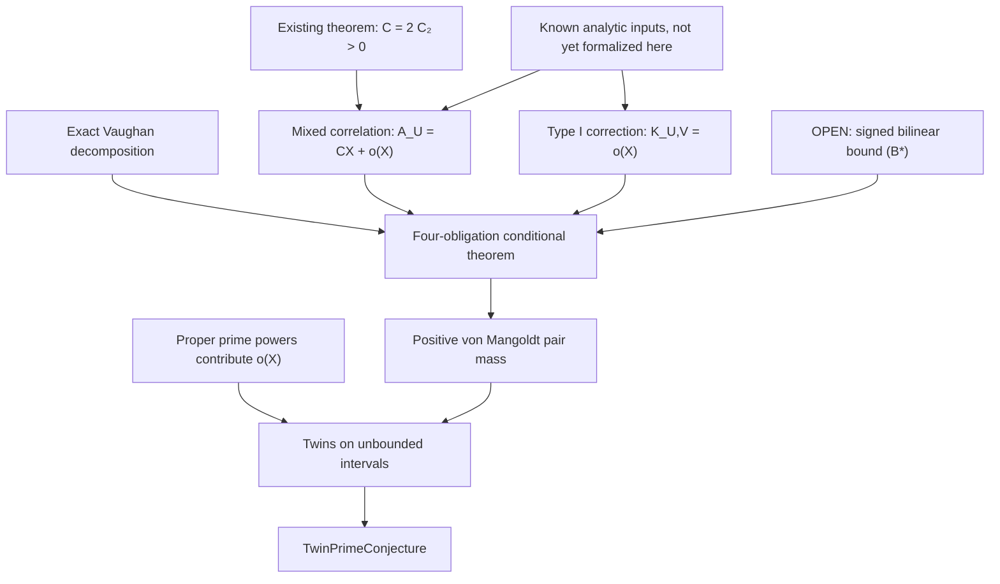

# A proof program for the twin prime conjecture

Implementation update (2026-09-05): see [PROOF_OBLIGATIONS.md](docs/PROOF_OBLIGATIONS.md)
for the current checked results and unresolved inputs. The finite dyadic endpoint,
sublinear prime-power error, cutoff Vaughan decomposition, exact totient formula
(Q), and conditional budget have been implemented. M0–M3 are implemented.
The weighted progression applications, shared-prime correction limit, and
reductions of (A) and (K) to explicit BV and ordinary Mertens inputs are now
Lean-checked, including the smoothed boundary constants and Euler product.
The bilinear prime-power removal and finite rough-parity identity also check.
The exact dispersion inequality, full right-closed box partition, and summed
diagonal saving are now formalized. The nonzero boxes occupy at most three
product levels, improving the complete large-gcd dispersion budget to
O(X/log^2 X). At G=ceil(log^10(4X+4)), the original bilinear sum can be
restricted simultaneously to gcd(d,r)≤G and inputs without a prime square
p² with p>G, with error O(X/log^7 X). Every squarefree input survives these
restrictions. The remaining signed sum is unestimated; see the
[range-removal proof map](docs/DISPERSION_GCD_ROUTE.md).
The [prime-beta reduction](docs/BILINEAR_PRIME_BETA_ROUTE.md) now removes
proper prime powers inside beta with absolute error O(X log^2(X)/sqrt(V)).
At the primary cutoff this is o(X), even after any fixed logarithmic loss.
Exact grouped cancellation for a bounded nontrivial small-prime part and
the prime-only smooth/rough coefficient formula are formalized. The remaining
weighted prime subrange still has no estimate that closes B*.
The [signed cutoff change](docs/CUTOFF_SHIFT_ROUTE.md) now raises the
right cutoff to floor(X^(1/4)) with o(X) error. More generally it allows
U(X)W(X)≤X^a eventually for any fixed 0≤a<1/2, with primary U.
This is a complete signed sum estimate; it cannot be restricted arbitrarily.
The resulting mixed coefficient retains m_U and has an explicit negative
middle-prime class. B* remains unresolved.
The [finite classical center](docs/CLASSICAL_CENTER_PRECISION.md) retains
the exact Type I main terms. Its actual correlation error, centered cutoff
change, and quarter prime-beta replacement are o(X/log^k X) for every fixed
natural k. A cofinal gain cX/log^k X above that center is a sufficient
alternative endpoint, but no such gain has been proved. M4-M6 remain open.
The [smoothing audit](docs/SMOOTHED_SIGNED_GAIN_REVIEW.md) now computes
the nonzero main displacement caused by full logarithmic cutoff averaging;
its exact center compensates it. This paper result and finite sign witness
reject an o(X)-replacement shortcut without providing the required gain.
The [middle-prime sieve bound](docs/MIDDLE_PRIME_SIEVE_BOUND.md) supplies
a paper upper bound for the complete negative class with prime smooth part
between the cutoffs. At right exponent 21/100 its mass is eventually at
most 0.263 C X. Its finite sieve and modulus aggregation are formalized;
the actual thresholds, prime main sum and all weighted errors are now supplied.
The eventual 0.263 C X class bound is fully proved in Lean. The
[total signed budget](docs/SIGNED_TOTAL_BUDGET.md) still has zero certified
positive margin: the remaining R must be below 0.737 C X with positive
cofinal slack. Further formalization requires a paper improvement to that
complete inequality, including every residual; the signed gain remains open.
A complete Lean argument now derives quantitative Mertens from BV, including
the centered signed estimate, both real hyperbola remainders, logarithmic
unweighting, parameter choice, and actual supremum contraction. An
earlier endpoint retains BV and B* as hypotheses; the classical B* endpoint
supplies the proved classical inputs and assumes only B*. A specific Chen-weight
assessment identifies a negative mass-minus-leakage margin.
BV now has checked character reductions, conductor regrouping, logarithmic
totient weights, primitive replacement with error absorption, and the
primitive Gauss/Parseval transfer. Additive and primitive-character large
sieves with an explicit logarithmic loss are now proved. Primitive-character
interval cancellation, rectangular bilinear bounds, adaptive dyadic second
moments, and the exact product-cutoff staircase also check. The combined
maximal bilinear first moment is now proved, including independently chosen
character cutoffs and finite maxima. The full finite Vaughan Type II maximal
mean also checks, with exact coefficient masks, active boxes, and depth losses.
Type I factorization, weighted counting, and the eighth-root parameter choice
now prove the full maximal character mean with middle exponent 15/16 and
six logarithms. Its centered large-conductor tail is also proved.
The final asymptotic BV assembly and uniform pointwise-to-maximal conversion
now check: independent centered pointwise Siegel–Walfisz implies BV in Lean.
Character and pole-corrected zeta truncation and locally uniform convergence
now check for Re(s)>0. Explicit L-function growth, derivative bounds, a
local zero-multiplicity count, and the three-four-one logarithmic-derivative
inequality also check. Actual zero removal and its quantitative local
logarithmic-derivative expansion now check, with explicit conductor and height
bounds. Euler-factor corrections, the regular part at the zeta pole, and
the signs and multiplicities of actual zero contributions also check.
The resulting one-sided bound retains the reciprocal contribution of a
selected zero. Its three-four-one application now proves a uniform
primitive L-function zero-free region with at most one simple real zero
for each primitive character; such an exception requires a quadratic
character. Conjugation, near-one uniqueness, and actual multiplicity one
are formalized. A separate all-height zero-free region for regularized
zeta is proved, with the pole retained and no exceptional zero.
A checked comparison puts both regions in explicit logarithmic form.
The conductor truncation now gives a logarithmic-square derivative bound
near one and an actual zero-to-value estimate. Positive uniform constants
for finite conductor ranges also check. Four-factor convolution positivity,
its square lower bound, actual L-series identity, finite weighted-sum lower
bound, and regularized residue limit are proved. Complete-period cancellation
now gives pair and triple convolution bounds, and ordered triple convergence
is identified with the actual L-function product on Re(s)>3/4. The
four-factor summatory function has a proved main term λx with error at
most (1+3250q²)x^(4/5)(1+log x)² under the three nonprincipal conditions.
Centering the coefficients now proves a weighted residue comparison.
Exact inducing factors, common-level character transport, real signs,
and the auxiliary-zero dichotomy now prove the independent uniform Siegel
value lower bound. Its positive constants may be ineffective. The
arbitrary-power exceptional-zero gap is consequently proved without a
supplied value hypothesis. Actual smoothed Mangoldt-character Mellin inversion,
finite contour shifts, two-tail truncation, and finite unsmoothing now check.
Widened local expansions give complex norm bounds left of one, and the
polylogarithmic conductor family has proved uniform strip widths and budgets.
The resulting smoothed primitive-character contour estimate has no supplied
zero-free or distribution premise. The principal pole kernel is inverted
exactly. Uniform asymptotic error absorption, the principal contour assembly,
and centered finite differences now prove the independent Siegel–Walfisz
theorem. Its maximalization supplies BV and quantitative Mertens without
distribution hypotheses. The [classical proof map](docs/CLASSICAL_DISTRIBUTION_THEOREM.md)
records this completed M3 chain. M4–M6 are not complete.
In particular, the signed estimate (B*) and the unconditional conjecture
remain unproved. The original assessment below is preserved.

Assessment date: 2026-09-04. Reviewed commit: `5cf66a63bbc33b36f3c8d90373d2f6cce108f72a`.

This is a new assessment and forward plan. The earlier [program](docs/PLAN.md),
[parity note](docs/PARITY.md), and [research log](docs/RESEARCH_LOG.md) are useful
historical records; several of their mathematical interpretations need the
corrections below. The proposed files and theorems in this document are future
deliverables, unless explicitly identified as existing or checked during this audit.

Reading map: [assessment](#2-what-the-assessment-actually-verified),
[corrections](#3-corrections-needed-before-further-research),
[primary proof route](#5-primary-route-a-known-mixed-correlation-plus-an-explicitly-isolated-defect),
[the open estimate](#7-the-main-open-estimate-and-how-to-attack-it),
[milestones](#13-milestones-dependencies-and-decision-gates), and
[next ten tasks](#14-the-next-ten-concrete-tasks).

## 1. Decision and intended outcome

Keep the existing formal sieve library. Make the main research task an explicit,
signed correlation estimate that detects primality at the fixed shift **2**.
Build the finite identities and the conditional implication to twin primes first;
then attack the estimate they actually require. Improvements to the constant 4001
and further enumeration of twin primes should serve that task, rather than become
the measure of progress.

The existing work does not contain a proof of the twin prime conjecture, and I
have not found a known theorem that closes its remaining gap. There is no justified
schedule or guaranteed sequence of routine lemmas that ends in a proof. A firm
research plan can nevertheless specify the exact result that would suffice, the
known mathematics needed to use it, concrete ways to investigate it, and the
conditions under which an approach must be rejected.

The final deliverable remains the unconditional statement

```lean
theorem twin_prime_conjecture :
    {p : ℕ | Nat.Prime p ∧ Nat.Prime (p + 2)}.Infinite
```

The primary route below reduces a sufficient quantitative version of this goal
to a particular bilinear sum with explicitly defined Möbius coefficients. Its
central estimate is **open**. The reduction is a way to concentrate the research,
not evidence that the conjecture has become easy.

Three distinctions govern the program:

1. **Established and formalized:** results already checked in this repository.
2. **Established mathematics, needing adaptation or formalization:** for example,
   Bombieri–Vinogradov and suitable classical Möbius estimates.
3. **New mathematics required:** the signed lower bound in Section 7, or a
   replacement that demonstrably implies the same final goal.

Do not report movement within category 2 as having resolved category 3.

## 2. What the assessment actually verified

### 2.1 Source provenance

The initial assessment used a clean source snapshot at the reviewed commit.
The checked declarations and pinned dependency revisions below establish the
source of record; scratch calculations are not additional proved results.
Later dated checkpoints, their verification results, and the remaining
assumptions are recorded in the [proof-obligation ledger](docs/PROOF_OBLIGATIONS.md).

### 2.2 Build and proof trust

These commands were run from the repository root:

```bash
lean --version
lake build
lake env lean scripts/Axioms.lean
bash scripts/check_sorry.sh
```

Results:

- Lean reported version `4.32.0`, compiler commit
  `8c9756b28d64dab099da31a4c09229a9e6a2ef35`.
- Lake completed successfully, reporting **8679 jobs**. This was a normal build
  using the existing dependency cache, not a clean rebuild of Mathlib from source.
- All **21 declarations** listed in [scripts/Axioms.lean](scripts/Axioms.lean)
  reported only `propext`, `Classical.choice`, and `Quot.sound`.
- The repository's `sorry` check passed. An additional source scan found no
  `admit`, project `axiom` declarations, `native_decide`, `unsafe`, or
  `implemented_by` in the project Lean sources.
- There are 24 library source files including `TwinPrime.lean`, totaling 6185
  lines at this snapshot. The root imports all 23 submodules.
- The manifest pins Mathlib to
  `81a5d257c8e410db227a6665ed08f64fea08e997`.

The successful build and axiom results support the formal declarations' stated
claims. They do not certify numerical files, prose surrounding the declarations,
or an inference stronger than a theorem's actual type. The existing axiom script
is a selected audit, not an exhaustive declaration inventory.

### 2.3 Mathematical assets worth retaining

| Asset | Existing evidence | What it contributes |
|---|---|---|
| Exact target and elementary reformulations | [Basic.lean](TwinPrime/Basic.lean) | Infinitude, unboundedness, the `6k ± 1` form, and bounded gaps at most 2 are connected correctly. |
| Selberg upper-bound sieve | [Fundamental.lean](TwinPrime/Sieve/Fundamental.lean), [Expansion.lean](TwinPrime/Sieve/Expansion.lean), [ErrorSum.lean](TwinPrime/Sieve/ErrorSum.lean) | Reusable weights, main-term diagonalization, and remainder control. Some material is explicitly a port; do not claim all of it as new mathematics. |
| Twin local densities | [TwinSieve.lean](TwinPrime/Sieve/TwinSieve.lean), [Legendre.lean](TwinPrime/Sieve/Legendre.lean) | CRT root counts and exact congruence-count errors; the all-primes version handles the exceptional local factor at 2. |
| Brun's theorem | [Brun.lean](TwinPrime/Brun.lean) | `π₂(x) ≤ 2^33 x / log² x` for `x ≥ 2`, and convergence of the reciprocal sum. |
| Rough adjacent integers | [TwinRough.lean](TwinPrime/TwinRough.lean) | A genuine lower bound for a relaxed problem, with a logarithmic roughness cutoff. |
| Adjacent almost primes | [BrunAlmostPrime.lean](TwinPrime/BrunAlmostPrime.lean), [BrunBounded.lean](TwinPrime/BrunBounded.lean) | Infinitely many adjacent-by-2 integers with bounded total number of prime factors; the strongest current fixed bound is 4001. |
| General combinatorial lower sieve | [BrunHooleyBounds.lean](TwinPrime/Sieve/BrunHooleyBounds.lean), [BrunBlocks.lean](TwinPrime/Sieve/BrunBlocks.lean), [BrunFinal.lean](TwinPrime/Sieve/BrunFinal.lean) | A substantial reusable lower-bound framework, with explicit levels and errors. |
| Positive twin constant | [HardyLittlewood.lean](TwinPrime/HardyLittlewood.lean) | A well-defined product `C₂` and `0 < C₂ ≤ 1`. |
| Conditional endpoints | [Conditional.lean](TwinPrime/Conditional.lean) | Growth and positive lower bounds imply infinitude; useful endpoints for future analytic work. |
| Finite parity comparisons | [Parity.lean](TwinPrime/Parity.lean) | Exact comparisons of sieve expressions with Liouville discrepancies and parity-biased sequences. |

The current strongest lower-bound result is about **almost primes**, not about a
prime paired with an almost prime. In particular, the repository does not already
contain Chen's theorem, a proof of bounded prime gaps, or the analytic distribution
estimates that those results need.

The pinned Mathlib does contain von Mangoldt convolution identities,
Dirichlet characters and their orthogonality, L-function material, Dirichlet's
theorem on primes in progressions, Chebyshev estimates, Abel summation, and
almost-prime definitions. These should be reused. In particular,
`LSeries/PrimesInAP.lean` proves infinitude in invertible residue classes; that is
not the quantitative uniform distribution theorem needed below. The audit did
not locate ready-to-use Bombieri–Vinogradov, Siegel–Walfisz, Vaughan, or large-sieve
implementations in the pinned number-theory library.

### 2.4 Computational evidence and a reproduced defect

The committed data include counts to `10^13`, a GPU cross-check to `10^10`, parity
histograms, Liouville discrepancies, and a numerical Maynard functional search.
I inspected their implementations and tables. I did **not** rerun the entire
`10^13` enumeration or GPU experiments.

The existing Rust executable reproduced `π₂(10^6) = 8169`. Independently, a Python
smallest-prime-factor calculation at `N = 100000` matched every `A_d` and every
Liouville sum produced by `liouville_disc.exe` for all 61 squarefree moduli
`d ≤ 100`. Recalculating the summary of the committed `10^9` discrepancy table
gave 6083 rows, total absolute discrepancy 5663877, normalized mean approximately
0.758384, and normalized maximum approximately 3.653992.

There is a concrete endpoint bug in
[compute/twinsieve/src/main.rs](compute/twinsieve/src/main.rs):

```bash
compute/twinsieve/target/release/twinsieve.exe 5 3 5
compute/twinsieve/target/release/twinsieve.exe 6 3 5 6
```

The first run returns `π₂(5) = 1`; the second returns `π₂(5) = 2`, which is correct
because both `(3,5)` and `(5,7)` qualify. For an odd final limit, the final `hi`
has the wrong parity for the floor divisions computing the number of lower
members. The terminal odd candidate is omitted. The source explains the observed
failure. The committed powers-of-ten endpoints are even, so this defect does not
by itself invalidate those table entries, but arbitrary-endpoint correctness is
not established.

Also, `parity.exe` prints a finite ratio when the odd-parity count is zero, because
it divides by `odd.max(1)`. For example the `N = 10^6, z = 1000` row prints 8134
as the even/odd ratio despite zero odd entries. The counts remain useful; that
ratio must be presented as undefined or infinite.

The plan records these repairs as immediate work. No computational source was
changed as part of drafting this assessment.

## 3. Corrections needed before further research

### 3.1 The formal parity inequality is not a proof that every positive lower bound is impossible

The actual lower comparison is

\[
 L_\mu(x,z):=\sum_{d\mid P(z)}\mu^-(d)A_d(x)
 \leq \sum_{d\mid P(z)}|\mu^-(d)|\,|D_d(x)|,
 \qquad
 D_d(x)=\sum_{\substack{0\leq n\leq x\\d\mid n(n+2)}}\lambda(n).
\]

It holds for every weight satisfying the defined lower-Möbius condition, under
the theorem's size assumptions. It does not estimate the right-hand side. Even
an upper bound `o(x/log² x)` for that side would rule out a sieve lower bound of
the expected order, not every smaller positive or unbounded lower bound.

Likewise, the upper comparison is `2T ≤ U_μ + discrepancy`. A factor-two
asymptotic obstruction needs a suitably negligible discrepancy and an explicitly
restricted class of weights and levels. The inequality alone is not an
unconditional factor-two statement about every possible method.

For the statement that the entire sifted pair is prime, use the actual stronger
assumption `x + 2 < z²`. The lower obstruction only needs `x < z²` because its
proof uses primality of the first member. Some current docstrings conflate these.

### 3.2 Two different Liouville problems have been conflated

The formal proof uses `λ(n)`. The earlier informal example uses
`λ(n(n+2)) = λ(n)λ(n+2)` for positive `n`. They are different correlations.
The latter includes the two-point Chowla problem already at modulus 1; it does
not follow from a prime-number-theorem-strength estimate for a single Liouville
function. The known logarithmically averaged two-point result has a different
averaging measure and does not supply the required estimate on a moving, sifted
set. See [Tao's two-point correlation paper](https://arxiv.org/abs/1509.05422).

Even for the single-function `D_d`, a fixed-modulus theorem cannot be substituted
for a theorem uniform in `d ≤ x^θ`. An assertion `D_d = o(x/d)` without the
needed rate does not justify summing over moduli: the elementary absolute-value
bound introduces roughly a harmonic sum. With a uniform error factor `ε(x)`,
one gets approximately `ε(x) x log D`, which need not be `o(x/log² x)`.
An additional claim of signed cancellation is another estimate to prove.

Most importantly, improving the discrepancy estimate in the existing obstruction
does not reverse its inequality into a lower bound for twin primes.

### 3.3 The numerical square-root law is an observation, not a distribution theorem

The data test one large `x` and moduli only up to `10^4`. They do not establish
uniform cancellation at a power-of-`x` level. Root multiplicities also matter:
the actual comparison scale is based on `A_d ≈ x ρ(d)/d`, rather than simply
`x/d`. Any summed heuristic must retain these multiplicities and its logarithmic
losses. Use the exact weighted sum required by a proposed argument.

### 3.4 The stated value of the Maynard constant is wrong

`M₂ = 2 log 2` in the research log is false. The exact value is

\[
 M_2=\frac{1}{1-W(1/e)}=1.38593\ldots < 2\log 2 <2.
\]

Here `W` is the positive Lambert W branch. The exact value and the general upper
bound are separate results: Corollaries 6.3 and 6.4 of
[Polymath8b](https://arxiv.org/html/1407.4897). The existing computation agrees
well with the exact value; it does not establish equality with the upper bound.

The `k = 5` computed finite-grid value is below 2. Its Richardson extrapolation
above 2 is explicitly heuristic and is not a rigorous lower-bound certificate.
Even a finite-grid Rayleigh quotient computed in floating point needs rounding
control before it becomes a certified mathematical bound. Refinement along
arbitrary grid sizes is not automatically a nested sequence of trial spaces.

The standard two-coordinate Maynard criterion cannot reach the necessary
threshold even at level 1. More GPU optimization of that functional does not
remove its proved upper bound. Polymath's results at 246 unconditionally and 6
under GEH concern bounded gaps, not the specific pair `{0,2}`.

### 3.5 Infinitude does not imply the Hardy–Littlewood scale

The assertion `π₂(x) → ∞` is equivalent to infinitude. A lower bound
`π₂(x) ≥ c x/log² x` eventually is sufficient and substantially stronger; the
converse has not been proved. The Hardy–Littlewood asymptotic is stronger still.
The claim in `docs/PARITY.md` that the conjecture is equivalent to a lower bound
of the expected order should be removed.

### 3.6 Better almost-prime constants are not an established route to two primes

The fixed level `z^972` in the present Brun–Hooley bound explains the very small
roughness exponent and large total-Ω bound. Stronger Mertens estimates can improve
these constants and have independent formal value. They do not supply the
primality-sensitive information needed at the end. There is no justified
interpolation from `Ω(n)+Ω(n+2) ≤ 4001` down to 2.

The broader parity limitation is real, but it must be stated for specified sieve
information and hypotheses. It is not a theorem that all future proofs must take
one particular bilinear form. The explanation in
[Tao's parity essay](https://terrytao.wordpress.com/2007/06/05/open-question-the-parity-problem-in-sieve-theory/)
is a useful guide to the distinction.

## 4. The exact endpoint the analytic work must reach

Unless an explicit lower endpoint says otherwise, integer summation indices in
the following analytic formulas range over positive integers; in particular,
prime-power exponents satisfy `k ≥ 1`. Logarithms are natural logarithms, ratios
inside them are real ratios, and `log₂` denotes logarithm to base 2. A statement
`f(X) = o(X)` refers to `f(X)/X → 0` with the displayed parameter choices fixed.

Work on integer dyadic intervals. For `X ≥ 2`, define

\[
 N_2(X)=\#\{n:X<n\leq 2X,\ n,n+2\text{ prime}\},
 \qquad
 W_2(X)=\sum_{X<n\leq2X}\Lambda(n)\Lambda(n+2).
\]

Use `Λ` exclusively for von Mangoldt and `λ` for Liouville. Rename the
discrepancy `D_d` in mathematical prose to avoid confusing it with `Λ`.

The genuinely minimal target is

\[
 \forall Y\ \exists X\geq Y:\quad N_2(X)>0.
 \tag{TPC-dyadic}
\]

This is equivalent to the stated conjecture. It is enough to find good intervals
on an unbounded sequence; a proof need not put twins in every sufficiently large
dyadic interval. Formalize both the minimal endpoint and the stronger quantitative
endpoint used by the primary route.

### 4.1 Remove prime powers explicitly

`W₂(X) > 0` alone is insufficient: von Mangoldt also detects proper prime powers.
Let `E_pp(X)` be its contribution from terms where at least one member is not
prime. Then

\[
 0\leq E_{pp}(X),\qquad
 W_2(X)-E_{pp}(X)
 \leq \log^2(2X+2)\,N_2(X).
 \tag{PP}
\]

A deliberately crude sufficient bound is available without deep prime estimates.
For `Y = 2X+2`, the number of proper prime powers up to `Y` is at most

\[
 \sum_{2\leq k\leq\lfloor\log_2Y\rfloor}\lfloor Y^{1/k}\rfloor
 \leq \sqrt Y\,\lfloor\log_2Y\rfloor.
\]

Count both possible positions and use `Λ(m) ≤ log Y`. This gives

\[
 E_{pp}(X)\leq
 2\sqrt{2X+2}\,\lfloor\log_2(2X+2)\rfloor\,\log^2(2X+2)=o(X).
\]

Thus `W₂(X) ≥ cX` for a fixed positive `c` on unbounded `X` implies the
conjecture. An even weaker successful argument may show just
`W₂(X) > E_pp(X)` on unbounded `X`. Do not reject such a route for failing to
prove the full expected density.

### 4.2 First formal endpoint deliverables

Prove finite-interval definitions agree with `twinCount (2*X) - twinCount X`;
handle subtraction in naturals using monotonicity. Prove (PP), the proper-prime-
power bound, and both cofinal implications. Connect the result to
`twinPrimeConjecture_iff_forall_exists_gt`.

These are useful unconditional lemmas that can be written now. They must not
assume a twin-prime lower bound in the definitions of any auxiliary function.

## 5. Primary route: a known mixed correlation plus an explicitly isolated defect

Set

\[
 C=2C_2>0,\qquad U=V=\lfloor X^{1/5}\rfloor,
 \qquad
 \Lambda_U(n)=\sum_{\substack{d\mid n\\d\leq U}}\mu(d)\log(U/d).
\]

All subsequent cutoff identities are stated for sufficiently large `X`, so
`U,V ≥ 2` and `X > V`. In formal finite identities, state these side conditions
explicitly instead of using asymptotic shorthand.

Define the mixed correlation

\[
 A_U(X)=\sum_{X<n\leq2X}\Lambda_U(n)\Lambda(n+2).
\]

The known-input target is

\[
 A_U(X)=CX+o(X).
 \tag{A}
\]

This is established analytic number theory, not a twin-prime conjecture. For
example, the two-point case of Theorem 1.4 of
[Goldston–Yıldırım](https://arxiv.org/pdf/math/0111212) evaluates the relevant
mixed correlation in a range covering this cutoff. Its interval version uses
the same cutoff at both cumulative endpoints.

### 5.1 Derive the application rather than treating it as a black box

Interchange the finite sums:

\[
 A_U(X)=\sum_{d\leq U}\mu(d)\log(U/d)
       \sum_{\substack{X<n\leq2X\\d\mid n}}\Lambda(n+2).
\]

For odd `d`, the shifted prime lies in the reduced residue class `2 mod d`, so
the main term in the inner sum is `X/φ(d)`. For even `d`, that residue class is
not reduced; the nonzero von Mangoldt terms can only be powers of 2. Keep their
contribution as a separate negligible error. Never use `X/φ(d)` for even `d`.

The remaining main sum is

\[
 X\sum_{\substack{d\leq U\\d\text{ odd}}}
       \frac{\mu(d)}{\phi(d)}\log(U/d).
\]

Its limiting coefficient is `C`. Prove the Euler-factor identification with the
repository's `twinPrimeConstant`, including the factor at 2. The relevant local
ratios at odd primes are

\[
 \frac{1-1/(p-1)}{1-1/p}=1-\frac1{(p-1)^2},
\]

and omission of the prime 2 from the numerator supplies the additional factor 2.
The analytic justification of the limiting sum is part of the known mathematics
to be supplied; a formal Euler product identity alone does not prove a limit.

### 5.2 The distribution statement actually needed

Use a maximal Bombieri–Vinogradov form, with all quantifiers visible:

\[
 \psi(t;q,a)=\sum_{\substack{1\leq m\leq t\\m\equiv a\pmod q}}\Lambda(m).
\]

\[
 \forall A>0\ \exists B>0,\ K>0,\ X_0\geq2\ \forall X\geq X_0:
 \sum_{1\leq q\leq X^{1/2}/(\log X)^B}
 \max_{\substack{0\leq a<q\\(a,q)=1}}\ \sup_{0\leq t\leq2X+2}
 \left|\psi(t;q,a)-\frac{t}{\phi(q)}\right|
 \leq K\frac{X}{(\log X)^A}.
 \tag{BV}
\]

Conventions at small `t` can be adjusted in the usual way; specify one version
and prove the conversion to the interval sums. The factor `log(U/d)` costs at
most `O(log X)`. Choose `A` after accounting for this loss. The later Type I
term has moduli up to `UV ≤ X^(2/5)`, safely below the distribution limit for
sufficiently large `X` and any fixed logarithmic loss.

An outline of the known dependency chain is: character orthogonality, a suitable
large-sieve inequality, Vaughan's identity, control of small conductors through
Siegel–Walfisz or an equivalent route, and the maximal/partial-summation versions.
Use [Tao's large-sieve notes](https://terrytao.wordpress.com/2015/01/10/254a-notes-3-the-large-sieve-and-the-bombieri-vinogradov-theorem/)
to locate the precise classical statements. This is a substantial formalization
project. First expose (BV) as a named hypothesis and prove its applications;
subsequently discharge it with the known proof. Do not describe the final result
as unconditional while this hypothesis remains.

### 5.3 Why (A) is not already a lower bound for twins

The truncated divisor sum is signed on composites and is not a pointwise
minorant of `Λ`. Substituting it for `Λ` in a positive correlation requires a
separate argument.

Define the exact defect

\[
 T_U(X)=\sum_{X<n\leq2X}
       \Lambda(n+2)\bigl(\Lambda(n)-\Lambda_U(n)\bigr).
\]

Then `W₂ = A_U + T_U`. A lower bound for `T_U` that preserves a positive fraction
of (A) would suffice. This observation by itself is a reformulation of the hard
problem. The next section specifies the internal structure of `T_U` that the
research must exploit.

## 6. An exact decomposition of the missing term

This section gives the proposed reduction in enough detail to audit it before
formalization. The finite identities are algebraic. The limiting estimates in
Section 6.3 use classical analytic inputs that are not yet supplied by this
repository. The new conjectural step begins in Section 7.

### 6.1 Vaughan's identity with explicit cutoffs

Write `*` for Dirichlet convolution and `1` for the constant-one arithmetic
function on positive integers. Let `μ_≤U`, `μ_>U`, `Λ_≤V`, and `Λ_>V` denote
truncations. Starting from `Λ = μ * log`, `log = Λ * 1`, and `μ * 1 = ε`, obtain

\[
 \Lambda
 =\mu_{\leq U}*\log
  -\mu_{\leq U}*\Lambda_{\leq V}*1
  +\Lambda_{\leq V}
  +\mu_{>U}*\Lambda_{>V}*1.
 \tag{V}
\]

The `Λ_≤V` term vanishes on `n > X > V`. On that interval define

\[
 m_U(n)=\sum_{\substack{d\mid n\\d\leq U}}\mu(d),
 \qquad
 c_{U,V}(q)=\sum_{\substack{db=q\\d\leq U,\ b\leq V}}
             \mu(d)\Lambda(b),
\]

\[
 \beta_V(r)=\sum_{\substack{b\mid r\\b>V}}\Lambda(b)
       =\log r-\sum_{\substack{b\mid r\\b\leq V}}\Lambda(b).
\]

Notice the elementary bounds

\[
 |c_{U,V}(q)|\leq\log q,\qquad
 0\leq\beta_V(r)\leq\log r.
\]

They follow by summing `Λ` over divisors. In particular, the Type I coefficient
bound does not need an unexplained divisor-power loss.

The first term of (V) minus `Λ_U(n)` equals `log(n/U) m_U(n)`. Define

\[
 H_U(X)=\sum_{X<n\leq2X}\Lambda(n+2)\log(n/U)m_U(n),
\]

\[
 I_{U,V}(X)=\sum_{q\leq UV}c_{U,V}(q)
          \sum_{\substack{X<n\leq2X\\q\mid n}}\Lambda(n+2),
\]

and, crucially,

\[
 B_{U,V}(X)=
 \sum_{\substack{d>U,\ r>V\\X<dr\leq2X}}
       \mu(d)\beta_V(r)\Lambda(dr+2).
 \tag{B-definition}
\]

The exact identity is

\[
 \boxed{W_2(X)=A_U(X)+H_U(X)-I_{U,V}(X)+B_{U,V}(X).}
 \tag{D}
\]

All terms are finite, and all coefficients have now been specified independently
of whether a pair is twin prime. The identity retains the fixed shift 2.

### 6.2 What makes the first two corrections Type I

For `H_U`, interchange the divisor sum and use prime distribution in the
progression `2 mod d`, with `d ≤ U`. For `I_U,V`, the corresponding moduli are
`q ≤ UV`. With `U = V = floor(X^(1/5))`, their largest size is `X^(2/5)`.
The coefficients and partial summation cost only powers of `log X`.

The bilinear sum has both factors large:

\[
 U<d\leq\frac{2X}{V+1},\qquad
 V<r\leq\frac{2X}{U+1},\qquad X<dr\leq2X.
\]

Replacing `Λ(dr+2)` by an average using a theorem for unweighted progressions
does not evaluate this sum: the summation has the structured coefficient `μ(d)`
and the factorization-dependent coefficient `β_V(r)`. This is exactly where an
unjustified use of distribution results would hide the unsolved problem.

### 6.3 A detailed route to the known correction estimate

The desired known-input result is

\[
 K_{U,V}(X):=H_U(X)-I_{U,V}(X)=o(X).
 \tag{K}
\]

Here is a route that makes its requirements visible.

1. Establish the classical cancellation estimate

   \[
   F(t):=\sum_{\substack{d\leq t\\d\text{ odd}}}\frac{\mu(d)}{\phi(d)}
        \ll_A(\log t)^{-A}
   \]

   for every fixed `A`, for large `t`. Also establish the smoothed limit
   `sum μ(d)/φ(d) log(t/d) → C`. These are ordinary Möbius/prime-number-theorem
   inputs. They concern one multiplicative function, not a shifted prime pair.
   Supply a complete reference proof or derive them through the associated
   Dirichlet series and a quantitative zero-free-region argument. The current
   crude reciprocal-prime bound is insufficient for this step.

2. Applying (BV) and partial summation gives

   \[
   H_U(X)=F(U)\int_X^{2X}\log(t/U)\,dt+o(X)=o(X).
   \]

   The integral is `O(X log X)` and `log U` is comparable to `log X`; that explains
   why a rate for `F(U)`, rather than just `F(U) → 0`, was requested.

3. For the other Type I term, obtain

   \[
   I_{U,V}(X)=XQ(U,V)+o(X),\qquad
   Q(U,V)=\sum_{\substack{d\leq U,\ b\leq V\\db\text{ odd}}}
              \frac{\mu(d)\Lambda(b)}{\phi(db)}.
   \]

   The bound `|c(q)| ≤ log q` makes the application of (BV) explicit.

4. Check the non-coprime factors in `Q`; do not replace `φ(db)` by `φ(d)φ(b)`
   without a coprimality condition. Since `Λ(b)` is supported on prime powers,
   define, for odd primes `p`,

   \[
   F_p(U)=\sum_{\substack{d\leq U\\d\text{ odd},\ p\mid d}}
           \frac{\mu(d)}{\phi(d)}.
   \]

   The exact decomposition is

   \[
   Q(U,V)=F(U)\sum_{\substack{b\leq V\\b\text{ odd}}}
                       \frac{\Lambda(b)}{\phi(b)}
    -\sum_{\substack{p^k\leq V\\p\text{ odd prime}}}
             \frac{\log p}{p\phi(p^k)}F_p(U).
   \tag{Q}
   \]

   The first term tends to zero using the rate for `F` and an `O(log V)` bound
   for the remaining sum. To handle the second term, use

   \[
   F_p(t)=-\frac{F(t/p)-F_p(t/p)}{p-1}.
   \]

   Boundedness of `F` gives a uniform bound `|F_p(t)| ≤ M/(p-2)` for odd primes;
   for each fixed `p`, the same recurrence and `F(t) → 0` give `F_p(t) → 0`.
   Moreover,

   \[
   \sum_{k\geq1}\frac{\log p}{p\phi(p^k)}
      =\frac{\log p}{(p-1)^2}.
   \]

   The resulting bound by a constant times
   `log p / ((p-1)^2 (p-2))` is summable. Dominated convergence proves that
   the second term in (Q) tends to zero. This avoids assuming a uniform
   prime-number theorem with a growing exceptional prime `p`.

5. Bound even-modulus terms separately. A coarse aggregate error of
   `O(UV log³ X)` from powers of 2 is already `o(X)` for these cutoffs.
   Prove the precise endpoint and coefficient bounds before choosing the final
   logarithmic error budget.

This is a mathematical proof outline to turn into checked lemmas, not a claim
that those lemmas already exist. It provides a concrete audit of the supposedly
known side of the reduction. If an adaptation fails, repair this argument before
attributing the failure to the novel bilinear estimate.

### 6.4 Finite checks performed during this assessment

I checked Vaughan's identity exactly as an equality of coefficients of `log p`
for every `1 ≤ n ≤ 2000`, for four cutoff pairs `(1,1)`, `(3,5)`, `(7,11)`,
and `(13,17)`: 8000 exact finite checks. An independent direct summation also
checked (D), with the following floating-point diagnostics:

| X | U = V | A_U/(CX) | K_U,V/(CX) | B_U,V/(CX) | W₂/(CX) |
|---:|---:|---:|---:|---:|---:|
| 1000 | 3 | 0.830010 | 2.094276 | -1.839891 | 1.084395 |
| 10000 | 6 | 1.055454 | 1.198349 | -1.277911 | 0.975892 |
| 100000 | 10 | 1.113065 | 0.410974 | -0.518492 | 1.005547 |

The numerical identity errors were below `3 × 10^-9` in absolute value.
These checks detect transcription errors; they prove no asymptotic estimate.
They also give a useful warning grounded in data: at modest `X`, the known
correction `K` is large. One must not replace it by zero when interpreting a
numerical value of `B`. In particular, the proposed eventual bound below already
fails at some small `X`; that is consistent with its stated quantifiers.

Formula (Q) was separately checked exactly for all 625 cutoff pairs
`1 ≤ U,V ≤ 25`, coefficient by coefficient as rational multiples of `log p`.
These checks complement the algebraic derivation; they do not replace its proof
for arbitrary cutoffs.

## 7. The main open estimate and how to attack it

### 7.1 A precise sufficient target

With the fixed cutoffs above, prove

\[
 \boxed{\forall Y\ \exists X\geq\max(Y,X_0):
             B_{U,V}(X)\geq-\tfrac12 CX.}
 \tag{B*}
\]

Here `X₀` is a fixed sufficiently large threshold for the known estimates.
Equivalently, require the inequality on an unbounded sequence of `X` and then
discard a finite initial segment. The constant one-half is a convenient budget,
not an optimized or essential choice. Any fixed margin above `-CX`, with
compatible errors in the other terms, could work.

No proof of (B*) is provided by the current repository or by this plan. In the
presence of (A), (K), and (D), it is a genuine fixed-shift prime-correlation
problem. Naming it does not weaken its difficulty. Its advantage over a vague
request for “Type II information” is that the sequence, coefficients, cutoffs,
required sign, and scale are completely specified.

There is a useful exact interpretation of the remaining margin. From (A), (K),
(D), and `W₂ ≥ 0`, one obtains only `B_U,V ≥ -CX + o(X)`. If there were only
finitely many twin primes, the prime-power estimate would force `W₂ = o(X)` and
hence `B_U,V = -CX + o(X)`. The new estimate must exclude that extremal behavior
by a fixed positive margin. Positivity of the original correlation does not
already provide the margin. Conversely, (B*) is a sufficient stronger target;
the minimal cofinal criterion in Section 4 remains available if a proof yields
a much sparser infinite family.

### 7.2 A numerical error budget that really closes the argument

For sufficiently large `X`, require the following four inequalities:

| Obligation | Bound | Status |
|---|---|---|
| Mixed-correlation evaluation | `abs(A_U - CX) ≤ CX/8` | Known analytic input, to adapt/formalize. |
| Type I correction | `abs(K_U,V) ≤ CX/8` | Known-input argument in Section 6.3, to complete/formalize. |
| Signed bilinear contribution | `B_U,V ≥ -CX/2` on unbounded `X` | **New mathematics required.** |
| Proper-prime-power contribution | `E_pp ≤ CX/8` | Elementary eventual estimate, to formalize. |

Then (D) gives `W₂ ≥ CX/4`, so (PP) gives

\[
 N_2(X)\geq\frac{CX}{8\log^2(2X+2)}>0
\]

on unbounded `X`, proving the exact target. This is the conditional theorem to
build early. Its proof should be short once the four obligations are properly
typed. Its hypotheses must remain visible until they have all been discharged.

The dependency structure is:



### 7.3 First research task: map the factor ranges

Partition the sum into disjoint dyadic boxes with

\[
 M<d\leq2M,\quad N<r\leq2N,\quad X<dr\leq2X,
\]

retaining `d > U` and `r > V` inside every box. Keep the hyperbolic boundary
exact, or introduce a partition of unity and bound its boundary error. Every
pair `(d,r)` must occur exactly once in the discrete version.

For each box, record:

- The exponents `log M/log X` and `log N/log X` and the precise endpoint rules.
- The actual arithmetic coefficients `μ(d)` and `β_V(r)`.
- The signed sum, the sum of absolute values, and the separate contribution of
  prime-power values of `dr+2`.
- Any factorizations available in `d` or `r`, including repeated prime factors.
- Which published estimate applies, with its exact range and coefficient class.
- The amount of the total negative-error budget consumed by that estimate.

Use a coverage table over the full exponent interval, approximately `1/5` through
`4/5`. A proof covering only the central balanced box is incomplete. An appeal
to symmetry is invalid unless it also handles the different coefficients on
the two variables. The identity does not become symmetric by exchanging `d`
and `r`.

The total required bound is one-sided. It is acceptable to keep a favorable
signed main term or to combine cancellations across boxes. Bounding every box
absolutely by `o(X)` is a stronger optional objective. If a proposed estimate
is stated per box, account for the total number of boxes and all logarithmic
losses before concluding it sums to `o(X)`.

For comparison, using only `abs(μ) ≤ 1`, `β_V(r) ≤ log r`, `Λ(dr+2) ≤ log(2X+2)`,
and an elementary divisor-sum bound gives an absolute total no better than
`O(X log³ X)`. That crude bound illustrates why a sign-sensitive argument or a
real improvement in the arithmetic information is needed at scale `X`.

### 7.4 Three concrete analytic experiments

**Experiment A: a dispersion or bilinear-forms argument.** Start from the exact
box sums. Choose which variable to square and write the resulting diagonal,
off-diagonal, and boundary sums in full. Test whether completion, congruence
switching, or a spectral estimate yields information beyond the Type I counts.
If Kloosterman-type sums appear, record the exact modulus, shift, coefficient
norms, coprimality conditions, and saving after every summation. A saving before
the last modulus sum is not a saving for (B*).

The main trap is immediate: squaring may introduce correlations such as
`Λ(d₁r+2)Λ(d₂r+2)`. Replacing them by their expected asymptotic would assume
another prime-pair problem. Do not classify that step as routine orthogonality.
The first useful deliverable is an exact expression identifying whether the
remaining off-diagonal problem is actually easier than the original one.

**Experiment B: exploit the structure of the Möbius coefficient.** Factor or
decompose `μ(d)` in selected ranges, using a proved identity with a complete
remainder. Investigate whether multiplicative-function cancellation can survive
the sparse weight `β_V(r)Λ(dr+2)`. Existing cancellation for a single multiplicative
function on ordinary or logarithmically averaged intervals does not automatically
survive that weight. Specify the norm in which a replacement is valid and show
that its error is small at scale `X`, not just at the scale of the ambient count
or an unweighted mean.

The first useful deliverable is a lemma with a genuine coefficient class and a
range that includes a nonempty portion of the required boxes. Proving a bound
for arbitrary bounded coefficients cannot be assumed: even replacing `μ(d)` by
1 destroys the cancellation one is trying to establish.

**Experiment C: preserve sign while using switching or a different identity.**
Try Buchstab, Heath-Brown, or a combinatorial decomposition if it improves the
range coverage or avoids an absolute-value loss. Write the exact replacement
for (D) and its finite coefficients before optimizing parameters. Allow a small
explicit unresolved region only if an upper bound for its negative contribution
fits strictly inside the available budget. A term cannot be dropped merely
because it is smaller in a heuristic factorization model.

The first useful deliverable is a proved inequality with explicit constants
whose remaining unknown term is measurably weaker than (B*), or has more usable
structure. If it simply restates `W₂ ≥ cX` under different notation, record that
fact and keep searching.

### 7.5 Use asymptotic-sieve results as a source of mechanisms, not an automatic application

[Friedlander–Iwaniec's asymptotic sieve](https://arxiv.org/abs/math/9811186)
demonstrates how a suitably formulated bilinear hypothesis can add information
that an ordinary sieve lacks. An application to the sequence weighted by
`Λ(n+2)` requires checking that theorem's density, remainder, bilinear ranges,
coefficient restrictions, and square-factor hypotheses. The applicability of
the theorem is itself a task; no hypothesis may be imported from its successful
application to a different sequence.

Create a hypothesis-by-hypothesis table before considering a large formalization
of that machinery. If its required distribution level is unavailable for the
shifted-prime sequence, keep it as a conditional alternative. Do not conceal a
second open distribution conjecture behind the bilinear one.

### 7.6 Criteria for accepting, redirecting, or rejecting an idea

Continue an idea when it does at least one of the following:

- Proves a new estimate in a required factor range with all losses accounted for.
- Identifies an additional arithmetic property and proves how it defeats the
  parity-biased obstruction for the actual sequence.
- Gives a rigorous reduction to a more structured unknown statement, together
  with a credible tool that exploits the additional structure.
- Produces a counterexample or exact calculation that removes a false premise
  from the proof search.

Redirect or reject it when the argument relies on any of these steps:

- Replacing a short divisor sum by primality without bounding the signed defect.
- Applying a progression theorem beyond its modulus range or to unsupported weights.
- Estimating an average over shifts and concluding the case `h = 2`.
- Using a two-point Chowla conjecture, GEH, GRH, or another open hypothesis without
  retaining it explicitly in the final implication.
- Discarding a same-order semiprime, prime-power, boundary, or parity contribution.
- Demonstrating only that a finite range matches the Hardy–Littlewood heuristic.
- Returning to the standard `M₂` variational problem despite its rigorous ceiling.

An unsuccessful analytic approach should leave a short mathematical failure
record: exact target, attempted inequality, first unsupported step, and whether
the failure is logical, a range mismatch, a sign problem, or insufficient saving.

## 8. Secondary route: upgrade a Chen-type result through a parity-sensitive selector

This is a serious alternative research organization, not a known way around the
barrier. It shares useful analytic infrastructure with the primary route.

### 8.1 The known milestone and its prerequisites

Chen's theorem provides infinitely many primes `p` for which `p+2` has at most
two prime factors, counted with multiplicity. A quantitative version requires
a linear/weighted sieve, prime distribution, and switching. The ingredients are
far beyond replacing 4001 by a smaller constant in the present proof. A source
for a careful reconstruction is
[Tao's linear-sieve and Chen notes](https://terrytao.wordpress.com/2015/01/29/254a-supplement-5-the-linear-sieve-and-chens-theorem-optional/).

First select the exact variant to prove, including its interval, any roughness
condition, constants, multiplicities, and exceptional terms. Do not assume that
a useful roughness condition follows from a bare statement of Chen's theorem.
The known theorem and the desired strengthened variant are separate obligations.

### 8.2 Exact selector and the missing sign information

Let `a_X(p) ≥ 0` be a specified weight supported on

\[
 X<p\leq2X,\qquad p\text{ prime},\qquad \Omega(p+2)\leq2.
\]

For such a `p`, `p+2 > 1`, and therefore

\[
 1_{p+2\text{ prime}}=\frac{1-\lambda(p+2)}2.
\]

Define

\[
 C_a(X)=\sum_p a_X(p),\qquad
 L_a(X)=\sum_p a_X(p)\lambda(p+2).
\]

The weighted twin count is exactly `(C_a-L_a)/2`. A sufficient new input is

\[
 C_a(X)\geq c\frac{X}{\log^2X},\qquad
 L_a(X)\leq(1-\delta)C_a(X)
 \tag{Chen-parity}
\]

for fixed `c,δ > 0` on unbounded `X`, together with a proved bound on the maximum
weight that converts the weighted result to ordinary counting when needed.
For unweighted `a`, no weight-removal problem arises. For any nonnegative finite
weight, a strictly positive weighted twin count already supplies a twin pair.

The first estimate is a Chen-type task for the chosen weight. The second is
new primality-sensitive information. It is not a consequence of Chen's theorem,
and the identity alone is another endpoint reformulation. The research must
explain how the weight makes the second estimate more accessible.

### 8.3 What to compute and prove before formalizing all of Chen

Specify a roughness-localized or otherwise useful weight and derive its exact
semiprime leakage. For an unweighted rough subset this has the form

\[
 D(X;z)=\sum_{\substack{q\leq r\text{ prime}\\q,r>z\\X<qr-2\leq2X}}
             1_{qr-2\text{ prime}}.
\]

The convention `q ≤ r` counts each semiprime once and includes squares. The
constraint `qr-2` must remain in the fixed dyadic interval.

Derive an independent lower bound for the eligible prime/almost-prime mass and
an independent upper bound for this leakage, retaining constants and all
subtraction terms. The net coefficient must be strictly positive after errors.
Standard inequalities generally fail to provide that margin; displaying that
failure is essential to locating the required improvement.

Do not compare a small `cX/log² X` lower bound for all Chen pairs with an unrelated
upper bound for all semiprime shifts and expect a positive difference. Without
roughness or an appropriate weight, the semiprime mass can have a different
logarithmic size. Likewise, do not assume the cube-root roughness used in the
next section is available from a chosen Chen theorem.

Proceed with the full Chen formalization when the selected variant is useful
for a stated research estimate or is deliberately chosen as a separate known-
mathematics milestone. It must not indefinitely postpone work on the new sign
estimate.

## 9. A diagnostic using the existing rough-number machinery

This route supplies particularly clean finite identities and better experiments
than total-Ω parity alone.

For integers `X,z` with

\[
 3\leq z<X,\qquad 2X+2<z^3,
\]

let

\[
 R(X,z)=\{n:X<n\leq2X,\ \gcd(n(n+2),P(z))=1\}.
\]

Every prime factor of either member exceeds `z`, so each member has either one
or two prime factors, with multiplicity. Three factors would make it greater
than `z³`. Thus on this set

\[
 1_{n,n+2\text{ prime}}
   =\frac{(1-\lambda(n))(1-\lambda(n+2))}{4}.
\]

Writing `S = #R`, `L₀ = sum_R λ(n)`, `L₂ = sum_R λ(n+2)`, and
`L₀₂ = sum_R λ(n)λ(n+2)`, obtain the exact identity

\[
 \boxed{4N_2(X)=S-L_0-L_2+L_{02}.}
 \tag{R}
\]

All dyadic twins belong to `R` because `z < X`. There is therefore no missing
small-prime-pair correction in this version.

### 9.1 What this reveals and what it does not prove

An even value of `Ω(n)+Ω(n+2)` does not isolate twins: the signatures `(1,1)`
and `(2,2)` both have even total parity. The separate Liouville terms are
indispensable. The current histogram merges information needed for (R).

Do not assume `L₀`, `L₂`, and `L₀₂` are each `o(S)` at a cutoff growing near a
cube root. Sifting produces systematic parity bias. At a cutoff beyond a square
root, the set consists entirely of twins, so the exact values become
`L₀ = L₂ = -S` and `L₀₂ = S`; cancellation would be the wrong prediction.

A sufficient program would establish both a useful lower bound for `S` at the
chosen cutoff and a one-sided bound keeping `S-L₀-L₂+L₀₂` positive. Neither
estimate at the cube-root cutoff follows from the current Brun–Hooley theorem.
Alternatively, prove a positive lower bound for the combination directly. The
finite identity is helpful because it specifies what information is missing,
not because it supplies that information.

### 9.2 An independent finite check

For `X = 50000`, an independent factorization calculation gave:

| z | S | L₀ | L₂ | L₀₂ | `(S-L₀-L₂+L₀₂)/4` |
|---:|---:|---:|---:|---:|---:|
| 47 | 1292 | -378 | -330 | 76 | 519 |
| 317 | 519 | -519 | -519 | 519 | 519 |

Both satisfy the cube condition and give the direct dyadic twin count 519.
The second cutoff also satisfies the stronger square condition. This checks
the identity and illustrates why a naive cancellation assumption would fail.

Extend the computation to the full table
`# {n : Ω(n)=i, Ω(n+2)=j, n in R}` and to signed correlations with the exact
weights in a candidate argument. Include fixed `z` and `z` growing as a power
of `X` as separate experiments.

## 10. Other approaches and the conditions for promoting them

### 10.1 Circle method: a second exact interface to the same fixed-shift difficulty

Define `e(t) = exp(2πit)` and

\[
 S_X(\alpha)=\sum_{X<n\leq2X}\Lambda(n)e(n\alpha),\qquad
 T_X(\alpha)=\sum_{X+2<m\leq2X+2}\Lambda(m)e(m\alpha).
\]

Fourier orthogonality gives the exact identity

\[
 W_2(X)=\int_0^1 S_X(\alpha)\overline{T_X(\alpha)}e(2\alpha)\,d\alpha.
 \tag{F}
\]

The `+2` in the phase and the shifted support of `T_X` matter: the selected
condition is `m = n+2`. They should be checked by expanding the integral before
any asymptotic estimate is attempted.

Split the integral into a specified set of major arcs and its complement. Prove
the major-arc contribution is `CX+o(X)` using prime distribution and the same
singular series. The new task is a lower bound for the **real part of the signed
minor-arc contribution**, strong enough that it cannot cancel that positive
main term. A bound by `o(X)` would suffice but is stronger than necessary.

Parseval and an ordinary Cauchy–Schwarz argument typically give control at the
larger scale `X log X`; that does not settle a main term of size `X`. Similarly,
a minor-arc result averaged over many shifts does not identify the Fourier
coefficient at shift 2. A useful proposal must say what gains the missing scale
or preserves enough favorable sign at this particular coefficient.

Promote this route if a concrete exponential-sum, spectral, or additive-structure
lemma gives better access to that signed coefficient than the bilinear
formulation. Otherwise retain (F) as a cross-check and alternative language for
the same unknown. Do not build a large circle-method formalization solely to
rediscover the absent estimate at its last line.

### 10.2 Conditional distribution hypotheses

EH and GEH are worthwhile diagnostic assumptions: they reveal which obstacles
come from modulus ranges and which remain after distribution is strengthened.
They are not proved inputs to the final theorem. The distinction is illustrated
by [Tao's discussion of the Bombieri asymptotic sieve](https://terrytao.wordpress.com/2016/07/17/notes-on-the-bombieri-asymptotic-sieve/):
strong distribution information can still leave an undetermined parity-sensitive
quantity in a twin-prime correlation.

For each conditional experiment, produce a dependency diagram of the form
`[precisely stated distribution conjecture] + [precisely stated new correlation]
→ TPC`. Then determine whether either hypothesis can be weakened or discharged.
A conditional theorem is useful only when its remaining assumptions are more
informative than a renamed copy of the desired conclusion.

GRH, a statement about a single Liouville function, or logarithmically averaged
Chowla cannot simply be substituted for the missing weighted fixed-shift estimate.
Any claimed implication requires a proof with the actual ranges and weights.

### 10.3 Bounded gaps and other prime-producing mechanisms

A bounded-gap theorem proves that some sufficiently small gap recurs. That does
not specify the gap 2. A proposed upgrade must identify the step that forces this
particular admissible pair rather than merely some two coordinates of a tuple.

Successful methods for other polynomial sequences, extra-variable problems, or
function-field analogues can suggest an arithmetic mechanism. Before borrowing
one, state the feature that made it work and prove that an analogue exists for
the integers `n,n+2`. Extra averaging variables and algebraic geometry cannot be
removed by analogy alone. Treat this as a search for a new mechanism, not an
existing transfer theorem.

### 10.4 Priority table

| Route | Immediate useful result | What would justify sustained work | Priority |
|---|---|---|---|
| Truncated correlation and (B*) | Exact decomposition, known-error proof, explicit coefficient/range target | A new estimate or reduction covering a required part of the bilinear sum | Primary |
| Chen plus a signed selector | Useful weighted/rough variant and a correct leakage calculation | A strict positive margin after independently bounded semiprime leakage | Secondary |
| Cube-root roughness and four correlations | Exact identity and separate parity data | A genuine lower bound for the needed combination, with its roughness range justified | Diagnostic and possible alternative |
| Circle method | Exact Fourier identity and major/minor-arc budget | New fixed-shift signed minor-arc control | Alternative if a concrete idea emerges |
| Better Mertens/Brun constants | Sharper known theorem | A documented use in one of the above proof obligations | Supporting work |
| More standard `M₂` optimization or larger raw twin tables | Additional numerics within known behavior | No direct route past the established obstruction | Stop as a primary proof strategy |

## 11. Computation organized around mathematical decisions

### 11.1 Repair and validate the tools before using them to reject hypotheses

The first computational change should fix the final odd-endpoint defect in the
Rust twin sieve. Normalize the final segment geometry so the candidate lower
members are exactly the odd integers at most the requested limit, and allocate
the extra flag for each candidate's `+2` partner. Avoid patching only the displayed
count; the pair's reciprocal-sum contribution must also be included.

Verification for that fix should cover:

- Limits 0, 1, 2, 3, 5, 7, and both odd and even endpoints around several twins.
- The same checkpoint requested with multiple larger final limits. Its count
  must not depend on the run's final limit.
- Both sides of a segment boundary and a twin pair crossing a boundary, with
  explicit agreement about which segment owns the pair.
- A simple independent sieve on small ranges, including the two units beyond
  each limit needed to test the upper member.
- Brun partial sums, with numerical tolerances or rigorous intervals appropriate
  to their representation. Integer count agreement is separate from floating
  summation accuracy.

Fix the zero-denominator parity ratio display. Retain zero counts explicitly;
do not replace an undefined ratio with a plausible-looking finite number.

These are targeted correctness checks for actual mathematical observables.
Passing the existing powers-of-ten table alone would miss the reproduced bug.

### 11.2 New measurements for the primary route

Implement the exact quantities in (D), with the same conventions as the proposed
Lean definitions. Store at least

```text
source_commit, binary_hash, X, U, V, interval_convention,
A_U, H_U, I_UV, B_UV, W_2, proper_prime_power_mass,
direct_twin_count, identity_residual, arithmetic_precision
```

For factor-box experiments also record `M,N`, all cutoff intersections, sign
statistics, coefficient norms, and the method used for any local main term.
Keep the full signed sums in addition to absolute-value bounds. Otherwise the
experiment can hide the very cancellation the proof needs.

Use two implementations for the decomposition: one computes the original
von Mangoldt correlation directly; the other enumerates the convolution or
factor pairs. Check them at small scales before extending the range. Exact
coefficient arithmetic in the basis of logarithms of primes is useful for the
finite identities. High-precision or interval evaluation can then handle the
real-valued sums.

Start with a geometric sequence of moderate `X` and several admissible cutoff
pairs. Scale up only when a run answers a specific question, such as where the
negative contribution concentrates, whether a proposed coefficient bound fails,
or whether a theoretical error dominates the range currently accessible.

Do not fit `B/(CX)` while silently replacing `K/(CX)` by its limiting value.
The assessment's small-scale table shows that this can give a misleading picture
even when the algebraic identity is correct.

### 11.3 Experiments that can eliminate bad assumptions

For every candidate estimate, specify its quantifiers before running it. Vary
the parameters those quantifiers claim to cover, including:

- Fixed moduli versus moduli growing with `X`.
- Fixed roughness cutoffs versus cutoffs growing with `X`.
- Individual Liouville signs versus their product.
- Signed weights versus their absolute values.
- Prime powers and repeated factors versus squarefree approximations.
- Exact shift 2 versus averages or other admissible shifts.

Where a proof claims to use only divisibility information, compare its finite
statistics with a parity-biased sequence such as `1+λ(n)`. For a prime-weighted
analogue, examine `Λ(n+2)(1+λ(n))`. This second sequence eliminates the prime
part of the first coordinate, but closeness of its Type I data to the original
sequence is itself a question to check; do not assume it.

An estimate that would also prove twin primes in a twin-free comparison model
must contain an invalid inference or an additional hypothesis that the model
does not satisfy. Identify which. This is a mathematical stress test, not a
claim that the currently measured discrepancies prove an asymptotic no-go result.

### 11.4 How CPU, GPU, and symbolic tools should contribute

| Tool | Useful role | Required output |
|---|---|---|
| Rust/CPU | Segmented arithmetic tables, exact counts, factor-box enumeration | Reproducible integer data and checked boundary conventions |
| Python | Independent implementations, inspection of parameter ranges, plotting and bookkeeping | Small trusted checks and explicit comparisons with proposed inequalities |
| PARI/GP or arbitrary-precision arithmetic | Euler products, Möbius/totient sums, singular-series and error constants | Precision stated; interval or exact certificates where a numerical sign is used in a proof |
| GPU | Evaluate many genuinely relevant weight candidates or block statistics | Candidate weights with enough data to reconstruct and certify them |
| Maple/Magma or other symbolic systems | Specific algebraic transformations, factorizations, or exact finite calculations when needed | An identity or certificate that can be checked independently |
| Lean | Verify statements, finite identities, inequality assembly, and eventually the analytic proof | A theorem with explicit hypotheses and an audited axiom dependency list |

There is no benefit in saturating the GPU merely because it is available. In
particular, a large tensor search in an already excluded Maynard space does not
address (B*). Optimize research relevance before runtime.

### 11.5 What a finite numerical certificate can prove

Numerical optimization may prove a finite-dimensional inequality after a rational
or interval certificate is supplied. A proof using that inequality still needs
analytic error bounds, coverage of the continuous parameter region if relevant,
and control of all sufficiently large `X` or an unbounded set of good `X`.

For a variational lower bound, retain the actual trial function and certify its
Rayleigh quotient. For an upper bound, retain a valid dual or analytic bound.
Richardson extrapolation supplies neither kind of certificate by itself.

A finite count cannot prove infinitude. Conversely, an infinitude proof based
on eventual estimates does not require checking every small `X` below its
threshold. Do not spend months computing an irrelevant finite initial segment.

## 12. Formal architecture and proof interfaces

### 12.1 Add a thin endpoint layer before a large analytic library

The existing `Conditional.lean` contains useful global-growth implications.
Extend the interfaces with dyadic and weighted versions rather than duplicating
the elementary proof of infinitude in each research branch.

The proposed organization is:

| Proposed module or artifact | Purpose | First acceptance criterion |
|---|---|---|
| `TwinPrime/PrimePairSums.lean` | Define `N₂`, `W₂`, and proper-prime-power mass; connect to `twinCount` | Finite identities and the cofinal endpoint theorem compile |
| `TwinPrime/Analytic/TruncatedMangoldt.lean` | Define `Λ_U`, `m_U`, and the mixed correlation | Definitions use real logarithms of real ratios; divisor-sum identities proved |
| `TwinPrime/Analytic/Vaughan.lean` | Truncated arithmetic functions, (V), coefficients `c` and `β`, identity (D) | Exact finite identity with all size and nonzero assumptions explicit |
| `TwinPrime/Analytic/PrimeDistribution.lean` | A precise maximal distribution hypothesis and its interval/weighted consequences | No hidden use of EH; errors and modulus ranges preserved |
| `TwinPrime/Analytic/MoebiusTotient.lean` | `F`, the smoothed limit, `F_p`, and the non-coprime correction (Q) | Known-input statements isolated and the algebraic reductions checked |
| `TwinPrime/Analytic/MixedCorrelation.lean` | Derive (A) and (K) from the named known inputs | Exact match between the external theorem hypotheses and their uses |
| `TwinPrime/Analytic/Bilinear.lean` | Define the precise sum and disjoint factor-box decomposition | Coverage, coefficients, and any summed error budget proved |
| `TwinPrime/ConditionalBilinear.lean` | Assemble the four-row budget into infinitude | A checked implication with the new estimate explicitly assumed |
| `TwinPrime/RoughParity.lean` | Cube-root Ω bound and four-term identity (R) | Prime/semiprime/square cases handled without an asymptotic assumption |
| `TwinPrime/Chen/…` | Only the selected useful Chen variant and selector lemmas | Scope and dependency costs agreed in the mathematical design |
| `docs/PROOF_OBLIGATIONS.md` | Current list of known-input and open obligations | Every unresolved estimate has one precise statement and status |
| `docs/FAILED_APPROACHES.md` | Mathematical failure records | Each record identifies the first unsupported step |

These paths are suggestions for future implementation, not files created by this
plan. Prefer fewer modules if that keeps dependencies clearer. Add imports to the
root only when the corresponding module is ready.

### 12.2 Reuse the pinned library accurately

Useful existing facts include the von Mangoldt identities in
`Mathlib/NumberTheory/ArithmeticFunction/VonMangoldt.lean`, especially
`moebius_mul_log_eq_vonMangoldt`, `vonMangoldt_sum`, `vonMangoldt_apply_prime`,
and `vonMangoldt_le_log`. The almost-prime API includes both **exactly** and
**at most** `k` prime factors. Use the latter where Chen-type language requires
it; handle `0` and `1` through explicit support conditions.

The project already provides primorial/coprimality lemmas and prime-factor
arguments in `Parity.lean`, and quantitative Ω estimates in the Brun files.
Use these to prove the finite cube-root lemma. Do not introduce a new
incompatible meaning of roughness or prime-factor count.

For natural-number intervals, make the endpoint convention visible in theorem
names or documentation. Cast to reals before division and logarithms. A Lean
expression using natural division inside `log(U/d)` would encode a different
quantity from the mathematics here.

### 12.3 Keep known-input assumptions distinct from the new estimate

It is reasonable to define a proposition encoding the exact needed form of
Bombieri–Vinogradov while its proof is being imported. It is also reasonable to
define a proposition encoding (B*). Their status is different and must remain
different in documentation and theorem signatures.

The first conditional assembly should say, in effect:

```text
mixed correlation estimate
+ Type I correction estimate
+ cofinal signed bilinear lower bound
+ proper-prime-power error bound
=> TwinPrimeConjecture
```

The eventual unconditional theorem must construct each input from proved
lemmas. An argument field containing (B*) is still an assumption even if it
does not appear in `#print axioms`. An axiom audit and an audit of the theorem's
type are both necessary.

Do not introduce `axiom`, `sorry`, `admit`, inconsistent typeclass assumptions,
or a definition that includes the desired conclusion as part of its contract.
If an open statement is packaged as a `Prop`, all uses of it remain conditional.

### 12.4 Build and verification discipline

Use the checked source revision and pinned toolchain/dependency configuration.
Run the build and audit commands from the repository root. Compiled caches are
platform-specific; regenerate incompatible artifacts when changing platforms.
Keep the source revision associated with each verification result explicit.

For each meaningful new theorem, require:

- Its type matches the mathematical statement, including quantifiers, support,
  signs, cutoffs, and exceptional cases.
- All newly introduced lemmas needed by it compile with the pinned toolchain.
- The normal root build succeeds and the theorem is reachable through imports.
- Its axiom dependencies are audited, along with dependencies that implement
  computational certificates.
- A reader can identify every remaining analytic assumption directly from the
  theorem statement and the obligation ledger.

The text scan in `check_sorry.sh` is a useful guard but is not the complete trust
check. Expand the axiom script when adding public milestones, and ultimately
audit the entire dependency chain of the final theorem.

## 13. Milestones, dependencies, and decision gates

The audit in Section 2 is completed work. The milestones below are the proposed
implementation and research program. They are ordered by mathematical dependency,
not by a promised date for solving an open problem.

### M0 — Correct the working picture

**Deliverables:** update the historical explanatory documents and README to
reflect Section 3; repair the observed computational defects; record the
toolchain, source commit, and numerical provenance convention.

**Acceptance:** a reader can distinguish each existing theorem from its heuristic
interpretation, and the endpoint reproducer returns the same checkpoint count
regardless of the run's final limit. Preserve the original computational tables
and record whether a correction actually changes any entry.

**Decision:** once this is done, stop polishing the historical presentation.
Proceed to the finite reduction. M0 is quality control, not the mathematical
breakthrough.

### M1 — Prove the finite endpoint and decomposition

**Deliverables:** `N₂`, `W₂`, (PP), the cofinal endpoint theorem, the cutoff
version of Vaughan's identity, definitions of `A,H,I,B`, and exact identity (D).
Add the finite algebra behind (Q) and the coefficient bounds.

**Acceptance:** all identities are proved for their stated finite domains, the
same quantities agree with independent small computations, and no distribution
or twin-prime assumption appears in these algebraic theorems.

**Decision:** if a proposed identity fails, fix or replace it before proceeding.
Numerical asymptotics cannot compensate for a wrong finite decomposition.

### M2 — Build the complete conditional theorem

**Deliverables:** a theorem assembling the exact four-row budget in Section 7.2,
with cofinal rather than unnecessarily universal quantifiers for the new bound.
Write `docs/PROOF_OBLIGATIONS.md` with separate entries for (A), (K), (B*), and
the prime-power error.

**Acceptance:** substituting proofs of those four statements would literally
complete the target theorem, without another unlisted analytic lemma. Check
constant arithmetic, casts, intersections of eventual conditions, and the
passage from weighted mass to an actual twin pair.

**Decision:** this is the first firm reduction milestone. It is a conditional
theorem, not the conjecture's proof. The next research reports should refer to
its exact missing assumptions.

### M3 — Complete the known analytic side on paper and in Lean

**Deliverables:** complete proofs of the required Möbius/totient estimates,
the exact progression theorem, its weighted interval consequences, (A), and (K).
Produce a source-to-lemma map so external theorems are not silently strengthened
when translated into the formal API.

**Acceptance:** each imported analytic result is either actually proved in Lean
or still explicitly assumed in the theorem that uses it. A full proof of (K)
must include the shared-prime correction in (Q). The proof of (A) must identify
the constant with the existing product, including its factor at 2.

**Decision:** use the paper proof of the known input to conduct the novel
mathematical investigation while the formal library is being extended. Do not
wait to investigate (B*) until every classical analytic theorem has been
formalized. Conversely, do not call the final result unconditional before this
formal work is complete.

### M4 — Produce a new estimate, not just a new formulation

**Deliverables:** a complete factor-range map, reproducible signed statistics,
and a written attack on (B*) using at least one of Section 7.4's concrete
mechanisms. The main mathematical output must be a proved inequality or a
precise obstruction to the attempted inequality.

**Acceptance for a partial result:** identify exactly which part of the sum is
controlled, the size of the saved contribution, the constants or logarithmic
losses, and what remains. Record whether that improvement actually changes the
total error budget.

**Acceptance for the required breakthrough:** prove (B*) or a fully specified
replacement that closes the conditional theorem. Cover all remaining ranges,
all fixed-shift conditions, and the quantifiers at infinity.

**Decision:** if repeated work only recovers bounds that permit cancellation of
the entire positive main term, change the arithmetic input or decomposition.
Increasing the computation limit or refining a constant is justified only if it
addresses an identified uncertainty in that decision.

There is no defensible completion-time estimate for this milestone. It contains
the unsolved mathematics.

### M5 — Maintain useful alternatives without losing the primary objective

**Deliverables:** prove the finite rough-parity identity; evaluate whether a
specific Chen weight improves access to sign information; keep the circle-method
interface available if a concrete fixed-shift idea develops.

**Acceptance:** each alternative must have its own explicit implication to the
same twin-prime target and an honest list of new estimates. If a route needs both
an unproved distribution hypothesis and a new parity estimate, list both.

**Decision:** promote an alternative only when its required unknown is more
accessible for a stated mathematical reason, or a new theorem provides actual
range or error-budget progress. Do not rotate between equivalent restatements
and count that as advance toward the proof.

### M6 — Integrate, challenge, and verify an unconditional proof

**Deliverables:** a complete mathematical exposition and a Lean theorem with the
exact target type. Prove all the formerly assumed inputs, assemble the result,
and update the documentation to describe the final argument.

**Acceptance:** the proof survives the checklist in Section 15, a fresh build
and axiom/type audit, and an independent mathematical reading of the critical new
estimate. A discovery of a proof gap sends the affected obligation back to M3
or M4; a green build of a conditional theorem does not pass this gate.

## 14. The next ten concrete tasks

1. **Correct the claims, with the counterexamples and qualifications above.**
   Fix the descriptions of the parity inequalities, the two Liouville functions,
   the Maynard constant, and the distinction between infinitude and density.
   Record the current native build and axiom audit as the baseline.

2. **Repair and verify the Rust endpoint behavior.** Turn the reproduced odd-
   limit defect and checkpoint-invariance condition into small permanent checks.
   Correct the undefined parity-ratio display.

3. **Write the dyadic endpoint lemmas.** Establish the weighted correlation,
   prime-power subtraction, and cofinal-positive-count implications using the
   existing `TwinPrimeConjecture` interface.

4. **Formalize the exact cutoff algebra.** Prove Vaughan's identity with the
   chosen truncation conventions, then derive (D) and the bounds on `c` and `β`.
   Make these statements independent of any prime-distribution hypothesis.

5. **Write and check the Type I main-term calculation.** Include formula (Q),
   its shared-prime correction, the powers-of-2 exception, and the estimates
   actually needed for `F` and its smoothed sum. This prevents assigning a known
   main-term error to the conjectural bilinear term.

6. **Prove the conditional budget theorem and publish the obligation ledger.**
   At this point the exact missing mathematics should be readable in one theorem
   signature and one short table.

7. **Prepare the known-input proof map.** Locate exact versions of the analytic
   results, check every parameter specialization, and determine which pinned
   Mathlib facts can replace parts of their proofs. Implement only dependencies
   needed by the selected application.

8. **Implement factor-box measurements for the exact bilinear sum.** Verify the
   finite identity and box partition first. Use moderate scales to find whether
   a candidate inequality has wrong signs, missing local factors, or incorrect
   ranges before spending substantial CPU/GPU time.

9. **Attack one explicit analytic lemma that changes the budget.** Choose it
   from the coverage map. Write out the first dispersion, factorization, or
   switching calculation far enough to expose its true remaining correlation.
   A proved partial saving or a demonstrated obstruction is the deliverable.

10. **Review the result against the target before choosing the next iteration.**
    If no new estimate emerges, identify why and choose a different mechanism or
    a justified alternative route. Do not default to lowering 4001 or extending
    the raw prime table. Preserve failed approaches so the same unsupported step
    is not rediscovered in different notation.

Tasks 3–6 establish the reduction. Tasks 7–9 supply its mathematics. Task 10
keeps the project centered on the unconditional fixed-shift theorem.

## 15. Review checklist for any claimed proof

### 15.1 Mathematical target and quantifiers

- Does the conclusion produce infinitely many pairs at **exact gap 2**?
- If it proves positivity on a sequence of intervals, is that sequence proved
  unbounded? A finite list, however large, is insufficient.
- Are “eventually,” “for every,” “for almost all,” and “for infinitely many” kept
  distinct at every step?
- Are constants fixed independently of `X` where the limiting argument requires
  them to be? Are parameter choices made before invoking estimates whose
  constants depend on those parameters?
- Is a quantitative lower bound treated as a sufficient stronger result, rather
  than claimed to be equivalent to the conjecture?

### 15.2 Arithmetic content

- Does every distribution estimate apply to the actual weight and its complete
  modulus range? Are non-reduced residue classes handled separately?
- Are `λ(n)`, `λ(n+2)`, and `λ(n)λ(n+2)` distinguished?
- Are all prime powers removed or shown negligible at the required scale?
- Are repeated factors, semiprime squares, gcd/lcm factors, and the prime 2
  handled correctly?
- If a sieve is used to infer primality, is its roughness cutoff high enough for
  both `n` and `n+2`? If it only gives almost primes, where is the additional
  primality information proved?
- If a comparison model is invoked, are its claimed distribution properties
  themselves proved rather than assumed from a numerical resemblance?

### 15.3 Analysis and error accounting

- Is each finite sum rearrangement exact? Are exchanges of infinite limits and
  sums justified by the needed domination or convergence theorem?
- Is there a complete map of all factor ranges, including transition regions?
- Do coefficient norms, number of boxes, smoothing, truncation, and partial
  summation losses fit into the final budget?
- Does a favorable signed term remain favorable after any inequality used on it?
- Are claimed lower bounds genuinely lower bounds, with every discarded term
  having a justified sign or a proved bound?
- Does the final positive margin survive the errors, rather than equal zero at
  the limiting boundary?
- Does the proof require only known input plus the explicitly new theorem, or
  has another prime-correlation conjecture appeared inside a squared sum?

### 15.4 Formal and computational verification

- Does the final theorem have the displayed target type and no analytic
  hypotheses left in its arguments?
- Are the definitions of primality, intervals, weights, and cutoffs the intended
  ones, including real division rather than truncated natural division?
- Does the final theorem depend only on accepted foundational axioms, with no
  `sorryAx`, project conjecture axiom, or unsupported computational trust step?
- Are all relevant files imported and compiled from the reviewed source state?
- If a numerical certificate is used, is its statement finite, its arithmetic
  checked, and its connection to the infinite argument proved?
- Are numerical experiments clearly distinguished from certificates, and
  conditional theorems clearly distinguished from unconditional ones?

## 16. Focused reading and what to extract from it

Use primary mathematical sources to verify exact statements and restrictions.
Read for the obligation being addressed, rather than expanding the bibliography
without changing the proof search.

| Source | Concrete extraction task |
|---|---|
| [Goldston–Yıldırım, *Higher correlations of divisor sums related to primes I*](https://arxiv.org/pdf/math/0111212) | Check the two-point mixed correlation, cutoff uniformity, singular-series normalization, and the distribution input used by (A). |
| [Tao, large sieve and Bombieri–Vinogradov notes](https://terrytao.wordpress.com/2015/01/10/254a-notes-3-the-large-sieve-and-the-bombieri-vinogradov-theorem/) | Choose the precise maximal progression theorem and identify the known proof dependencies that must be supplied to Lean. |
| [Friedlander–Iwaniec, *Asymptotic sieve for primes*](https://arxiv.org/abs/math/9811186) | Inspect how the bilinear hypothesis differs from Type I information; audit applicability to the shifted-prime sequence before borrowing its conclusion. |
| [Tao, Bombieri asymptotic sieve notes](https://terrytao.wordpress.com/2016/07/17/notes-on-the-bombieri-asymptotic-sieve/) | Understand what parity-sensitive freedom survives stronger distribution assumptions, so a conditional calculation does not get mistaken for closure. |
| [Tao, linear sieve and Chen notes](https://terrytao.wordpress.com/2015/01/29/254a-supplement-5-the-linear-sieve-and-chens-theorem-optional/) | Select an exact Chen variant and reproduce its weighted subtraction and switching calculation with correct signs. |
| [Polymath8b, *Variants of the Selberg sieve*](https://arxiv.org/html/1407.4897) | Verify the `M₂` ceiling and distinguish standard variational criteria from strengthened methods and their conditional gap bounds. |
| [Tao, logarithmically averaged two-point Chowla/Elliott](https://arxiv.org/abs/1509.05422) | Compare the actual measure, coefficients, and averaging parameters with any proposed Liouville input; list the missing transfer steps explicitly. |

## 17. What a successful next stage would look like

The valuable next outcome is a checked finite reduction and a correctly
formulated analytic problem whose solution really would prove twin primes.
The primary candidate here is (B*), with the exact coefficient `β_V`, the
fixed shift 2, the full factor range, and the explicit budget in Section 7.2.

Beyond that reduction, progress must come from a new arithmetic estimate or a
better mechanism that replaces it. The existing formal work provides a useful
foundation and reliable endpoints. The plan keeps that foundation, corrects the
overstatements, and makes the remaining proof obligation explicit enough to
attack, test, and eventually verify.
